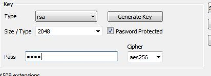
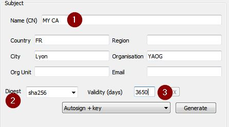
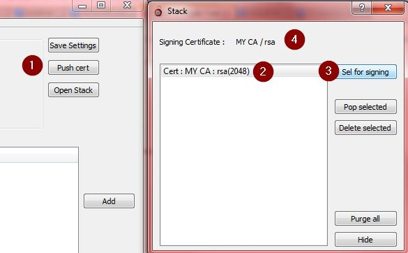

Full example
===============

About
-----

In this example is describe how to generate a self signed CA, generate and sign a web server certificate, save all to a pkcs12 structure and renew the certificate.

Generate the CA
---------------

We need a certificate authority, self signed, with x509 extensions of a CA.

First, choose a rsa key of 2048 bits with a password protection : 

Next, set 

1) the name of the CA. Only the CN is mandatory
2) the digest used to sign the key
3) validity in days : here set to 10 years. 

Date selection : You can either set validity in days starting from now, or select a starting and ending date by clicking  and choosing start/end date
To revert to number of days, click :  

Next, add some X509 v3 extensions to make it look like a real CA, for example add "CA=true" as critical extension as this is needed to be seen as a CA.

Note : a critical extension means that if the browser - or other soft -, doesn't understand the extension, it should not accept the certificate.

Add an extension : 

Then : 

1) Select "basicConstraint" as extension type
2) Click "Select"
3) Select "CA:TRUE"
4) Select Critical extension
5) Click "Add"
6) Click "OK" to add extension

Note : 

* "Add and continue" will allow you to add the extension then reset the form for the next one
* "Reset form" will allow you to select a new extension
* You can edit the value if needed

You should now see the extension you added :

Finaly select "Autosign+key" and click "generate".

Enter a serial number (or leave the random one) and click OK : 

The certificate and key (if no error is reported) are displayed - in pem format - in the lower edit box for you to cut & paste if needed. :

Now the CA is generated, save the certificate for later use : click "save" in the Certificate box.

Next, push the certificate in the stack to select it as signing certificate : 

1) Click "Push cert" (the system will ask you for the key password to decrypt it)
2) Select it in the stack
3) Click "Sel for signing"
4) The "MY CA" certificate is now the signing certificate

Generate a certificate to sign
------------------------------

Now, generate a certificate signing request (CSR) and sign it with the created CA.

(ONGOING DOC! COME BACK LATER)

